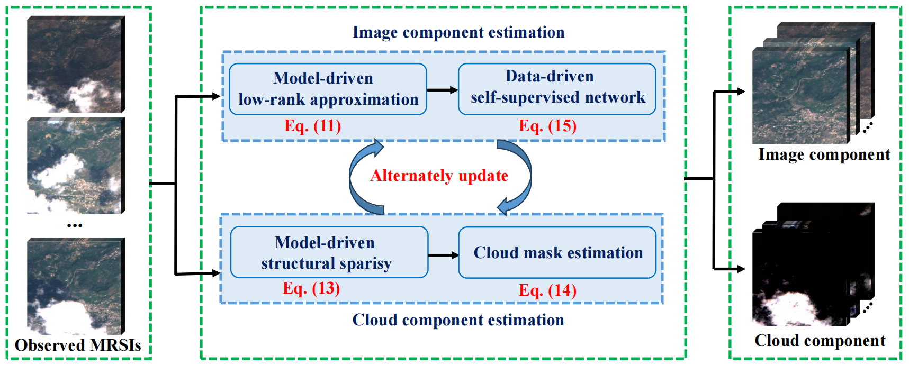

# LRRSSN: Thick Cloud Removal in Multitemporal Remote Sensing Images via Low-Rank Regularized Self-Supervised Network

## Description

**LRRSSN** is a novel method for thick cloud removal in multitemporal remote sensing images (MRSIs). It integrates model-driven low-rank and sparse decomposition with a data-driven self-supervised deep network. The method iteratively estimates the clean image and cloud component using an **HQS-based optimization** framework and employs a **Guided Deep Decoder (GDD)** to capture deep priors without external training data. The overall framework is illustrated below:



## Related Publication

If you use this method in your research, please cite:

## Related Publication

If you use this method in your research, please cite:

```bibtex
@article{chen2024lrrssn,
  author={Chen, Yong and Chen, Maolin and He, Wei and Zeng, Jinshan and Huang, Min and Zheng, Yu-Bang},
  journal={IEEE Transactions on Geoscience and Remote Sensing}, 
  title={Thick Cloud Removal in Multitemporal Remote Sensing Images via Low-Rank Regularized Self-Supervised Network}, 
  year={2024},
  volume={62},
  number={},
  pages={1-13},
  doi={10.1109/TGRS.2024.3358493}}
```

📄 [IEEE Link](https://ieeexplore.ieee.org/document/10414167) | DOI: [10.1109/TGRS.2024.3358493](https://doi.org/10.1109/TGRS.2024.3358493)


## How to Use?

1. You can install the dependencies with:

```bash
pip install -r requirements.txt
```

2. Clone the repository:

```bash
git clone https://github.com/try-agaaain/LRRSSN.git
cd LRRSSN
```

3. Run the main script:

```bash
python main.py
```

## License

This project is licensed under the [CC BY-NC-ND 4.0](https://creativecommons.org/licenses/by-nc-nd/4.0/).  The code is free to use for academic research and non-commercial purposes only. 